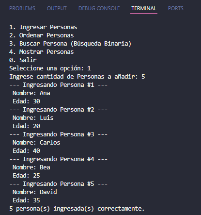
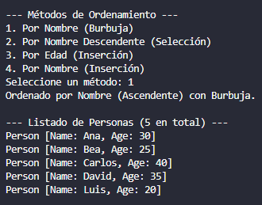
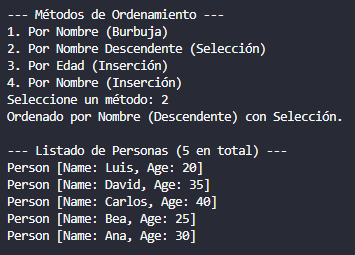
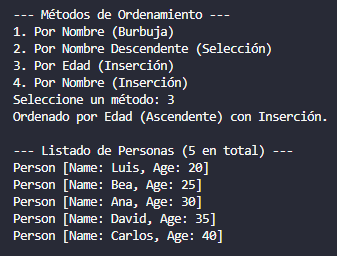
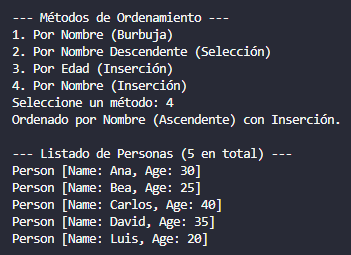
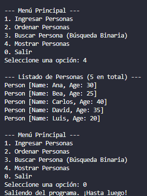

# 📚 Práctica 3: Algoritmos de Ordenamiento y Búsqueda (Búsqueda Binaria)

**Asignatura:** Estructura de Datos
**Carrera:** Computación

---

## 🎯 Objetivo de la Práctica

Implementar y reforzar los conceptos de **algoritmos de búsqueda y ordenamiento** aplicados a **objetos** en Java, estructurando el código bajo el **patrón Modelo-Vista-Controlador (MVC)** para una mejor organización.

---

## ⚙️ Funcionalidades Implementadas

El programa permite gestionar una colección de objetos `Person` (nombre y edad) y ofrece las siguientes operaciones a través del patrón MVC:

### 1. Modelo de Datos (`models.Person`)
* Representa una persona con atributos: **`name`** (String) y **`age`** (int).

### 2. Algoritmos de Ordenamiento (`controllers.SortingMethods`)
* Ordenamiento por **Nombre** usando el método de la **Burbuja** (`sortByNameWithBubble`).
* Ordenamiento por **Nombre Descendente** usando **Selección** (`sortByNameWithSelectionDes`).
* Ordenamiento por **Edad** usando **Inserción** (`sortByAgeWithInsertion`).
* Ordenamiento por **Nombre** usando **Inserción** (`sortByNameWithInsertion`).

### 3. Algoritmos de Búsqueda (`controllers.SearchMethods`)
* **Búsqueda Binaria** por **Edad** (`binarySearchByAge`).
* **Búsqueda Binaria** por **Nombre** (`binarySearchByName`).
* **Verificación de Orden**: El proyecto **valida** si el arreglo está ordenado por el criterio seleccionado antes de realizar la búsqueda binaria, y ordena si es necesario.
* **Impresión de estado:** Se muestra cada iteración del proceso de búsqueda binaria (valores de `bajo`, `alto`, `centro`, y la dirección de búsqueda).

---

## 🖼️ Estructura del Proyecto (MVC)

El proyecto sigue la estructura definida, separando las responsabilidades:

| Componente | Paquete | Responsabilidad Principal |
| :--- | :--- | :--- |
| **Model** | `models` | Datos (`Person`) |
| **View** | `views` | Interacción con el usuario (menú, entradas, salidas) |
| **Controller** | `controllers` | Coordina la lógica, el ordenamiento, y la búsqueda |

---

## Ingreso de Datos

## Ordenamientos de Datos

## Busqueda Binaria

## 🚀 Salida del Programa

